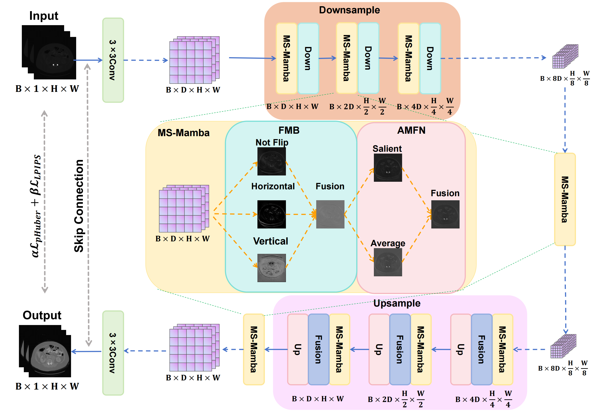
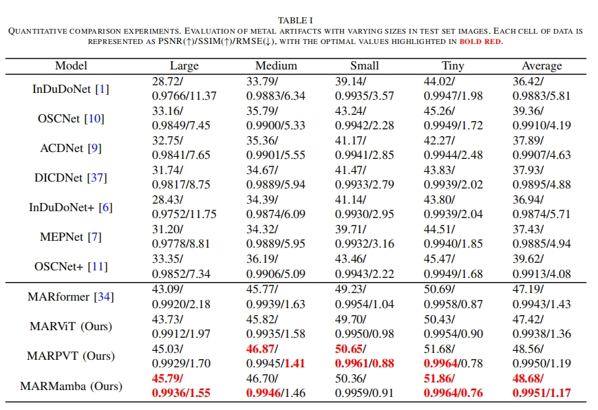
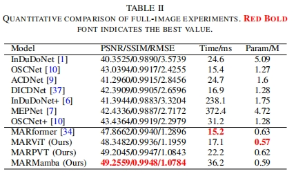
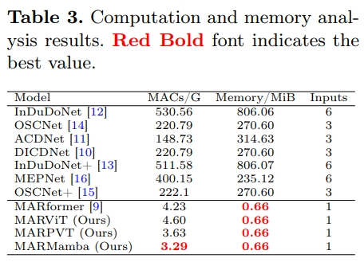
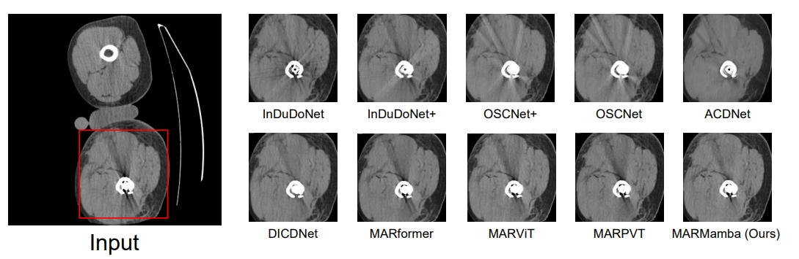

## MARMamba

This is the source code for MARMamba in paper "**Balancing Efficiency and Restoration: Lightweight Mamba-Based Model for CT Metal Artifact Reduction**".

### Architecture



### Requirement

The project is built with Python 3.12.3, CUDA 12.1 and Mamba 2.2.4. Using the following command to install dependency packages:

```
pip install -r requirements.txt
```

Specifically, our project requires the following libraries:

```
blobfile==3.0.0
einops==0.8.1
h5py==3.12.1
lpips==0.1.4
mamba_ssm==2.2.4
matplotlib==3.10.1
nibabel==5.3.2
numpy==2.2.3
opencv_python==4.11.0.86
Pillow==11.1.0
scipy==1.15.2
thop==0.1.1.post2209072238
timm==1.0.15
torch==2.3.0+cu121
torchvision==0.18.0+cu121

```

### Checkpoint

MARMamba checkpoint is available at path `checkpoint/MARMamba_ckpt`

## Document Introduction

The codes of MARMamba, MARViT, MARformer, and MARPVT are available at `model/`.

The `utils/` directory includes code related to training and test data processing and evaluation metrics.

### Datasets

[SynDeepLesion](https://github.com/hongwang01/SynDeepLesion): For training and testing.

[CLINIC-metal](https://github.com/MIRACLE-Center/CTPelvic1K): For visual comparison.

### Training

We trained MARMamba on a single RTX 3090. Using the following command to train MARMamba:

```
python train_step.py -learning_rate 0.0002 -num_steps 100000 -train_batch_size 8 -crop_size 256 256 -warm_up True -save_step 1000 -Tmax 1000 -exp_name checkpoint/syn -train_data_dir /root/autodl-tmp/SynDeepLesion -val_data_dir /root/autodl-tmp/SynDeepLesion
```

We also provide an auto-training script named `run.py` for training by using strategy mentioned in our paper. Modify the parameters in `run.py` and then execute `python run.py` to train.

### Testing

For inference and evaluation on **SynDeepLesion** dataset, run the following command in the `test/` path:

```
python test_deeplesion.py -save_place ./metal -checkpoint ../checkpoint/MARMamba_ckpt -val_data_dir /root/autodl-tmp/SynDeepLesion -test_mode no_metal
```

If you need to evaluate including the metal regions, change the parameter `-test_mode no_metal` to `-test_mode has_metal`.

To evaluate on **CLINIC-metal** dataset, run the following command in the `test/`path:

```
python test_clinic.py --save_path ./real --checkpoint ../checkpoint/MARMamba_ckpt --data_path /root/autodl-tmp/clinic/test
```

### Comparison Results

<details>
<summary><strong>Different Scales of Metal</strong> (click to expand) </summary>
    
</details>

<details>
<summary><strong>Full Images</strong> (click to expand) </summary>
    
</details>

<details>
<summary><strong>MACs and Memory</strong> (click to expand) </summary>
    
</details>

<details>
<summary><strong>Visual Comparsion on CLINIC-metal</strong> (click to expand) </summary>
    
</details>
